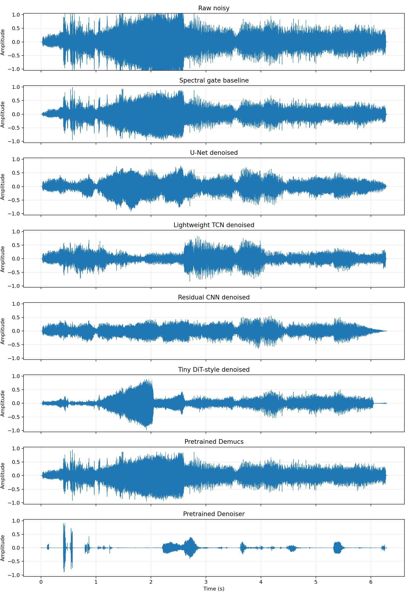
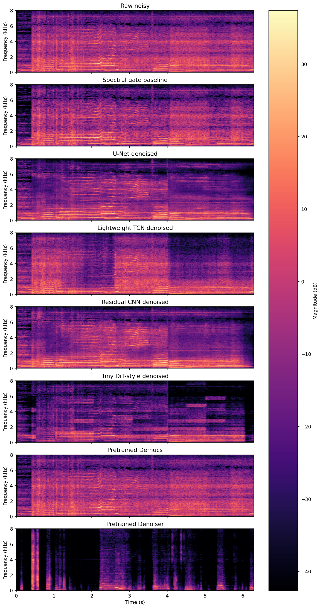
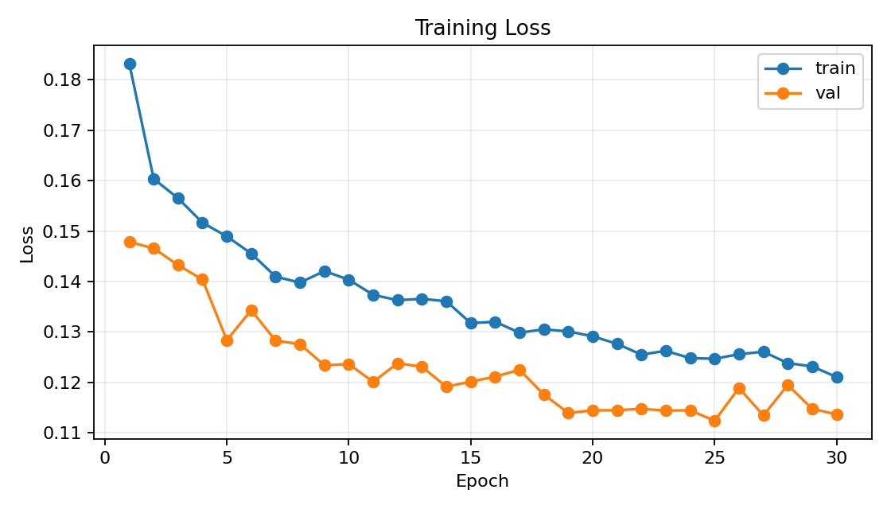
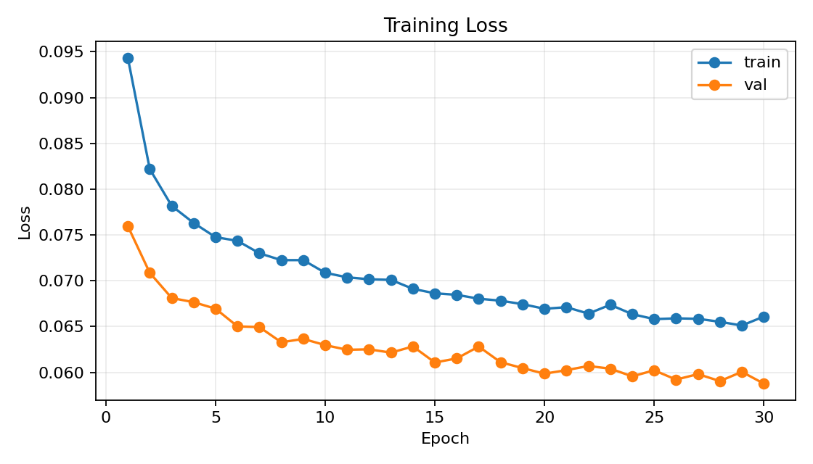
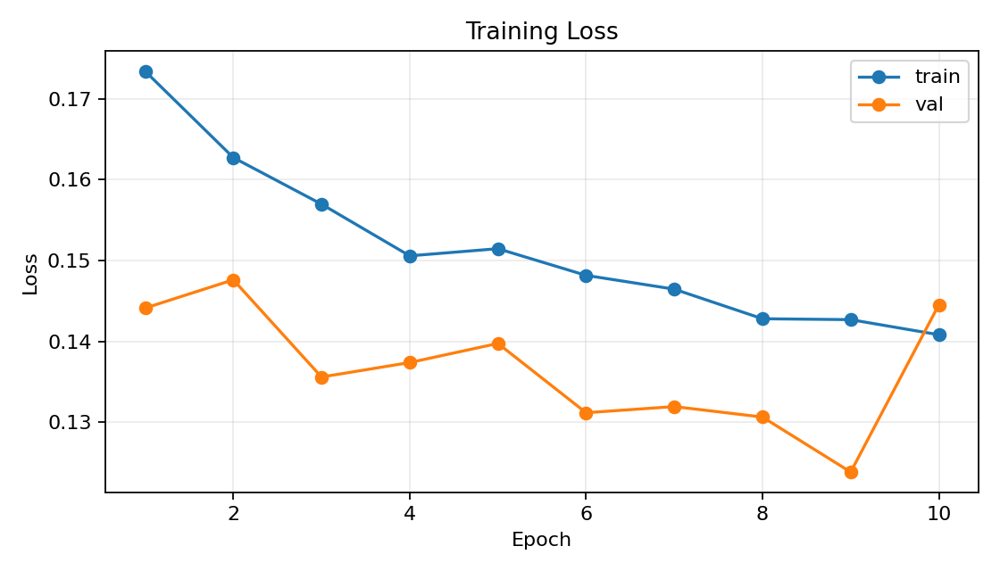
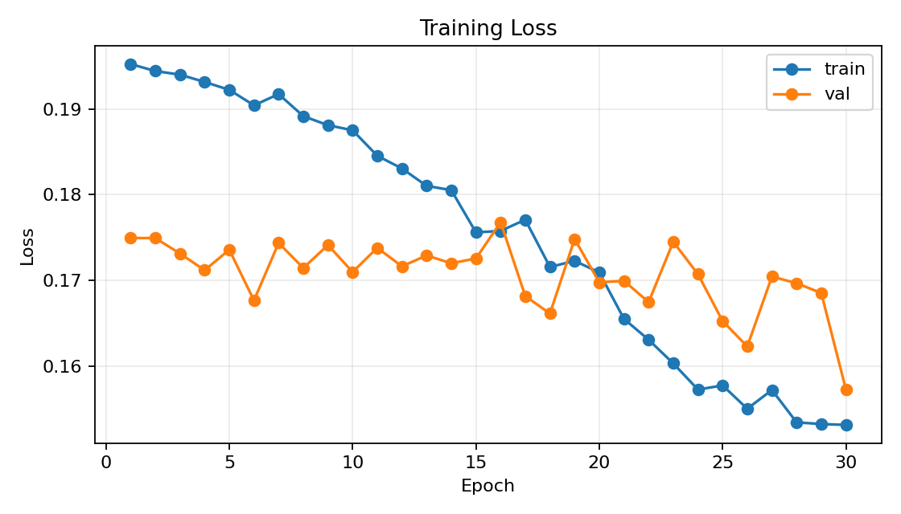

# 基于深度学习的音乐去噪实验报告

> 课程：智能导论 / 深度学习上机实验  
> 任务方向：音乐去噪  
> 小组成员：待填写  
> 姓名 / 学号 / 分工：待填写  
> 工程目录：`music_denoising_lab`

## 摘要

本实验选择音乐去噪任务，目标是从带噪音频中去除背景噪声，同时尽量保留原始音乐内容。实验使用 MUSAN 公开音频数据集构造训练数据，其中 `music` 子集作为干净音乐，`noise` 子集作为噪声来源，按照不同信噪比随机混合生成成对的 `noisy/clean` 样本。模型方面，本实验实现并比较了传统频谱门限方法、U-Net 频谱 mask 去噪、轻量 Conv-TasNet-style TCN、残差 CNN 频谱 mask、Tiny DiT-style patch Transformer，并额外测试了 Demucs 和 Denoiser 两个开源预训练模型的 zero-shot 效果。

在 100 条合成测试样本上，传统频谱门限方法的平均 SNR improvement 为 `+0.4100 dB`，自训练 U-Net 达到 `+5.1029 dB`，残差 CNN 达到 `+5.0030 dB`，轻量 TCN 达到 `+4.7023 dB`。实验表明，针对本任务用 MUSAN 合成数据训练的深度模型明显优于传统方法和未针对音乐去噪训练的预训练模型。对课程提供的固定测试音频 `raw.MP3`，本实验生成了多种方法的去噪音频、波形图和频谱图，用于主观听感和可视化对比。

## 1. 实验背景

音乐去噪是音频增强中的典型任务。实际场景中，音乐录音或传播过程中可能混入环境噪声、人声背景、设备噪声、电流声等干扰。去噪系统需要根据带噪输入恢复较干净的音乐信号，在抑制噪声的同时尽量保留旋律、节奏、音色和瞬态细节。

课程参考文档中给出的音乐去噪推荐方法包括 U-Net Spectrogram Denoising、Conv-TasNet、Demucs 和 Denoiser。为了兼顾可复现性、训练成本和报告分析，本实验以 U-Net 频谱增强作为主方法，并加入多个对照模型，从传统算法、频域 CNN、时域 TCN、Transformer 结构和开源预训练模型几个角度进行比较。

## 2. 任务定义

设带噪音频为 `x`，干净音乐为 `s`，噪声为 `n`，则有：

```text
x = s + n
```

音乐去噪的目标是根据 `x` 估计干净音乐 `s` 的近似结果 `ŝ`。在合成测试集上，因为有干净参考音频，可以计算 SNR 和 SNR improvement；对课程提供的固定验收音频 `raw.MP3`，由于没有对应的 clean reference，本实验不计算真实 SNR，只进行主观听感、波形图和频谱图对比。

## 3. 数据集介绍

### 3.1 固定验收数据

课程提供的固定测试音频为：

```text
course_lab_data/music_denoising/test/raw.MP3
```

本实验将其放置到：

```text
data/raw/raw.MP3
```

该音频只用于最终展示和主观听感分析，不参与训练，也不参与有参考指标计算。

### 3.2 训练数据：MUSAN

本实验使用 MUSAN 数据集构造训练数据。MUSAN 是公开音频语料库，包含 `music`、`speech`、`noise` 三类音频。本实验使用：

```text
music 子集：作为干净音乐 clean music
noise 子集：作为噪声 noise
```

本机下载并解压后的数据规模为：

```text
music: 672 files
noise: 934 files
speech: 430 files
```

实际训练中使用 `music + noise` 合成 paired dataset。数据统一处理为：

```text
sample_rate = 16000 Hz
channels = mono
segment_seconds = 4.0 s
segment_samples = 64000
```

合成方式为从干净音乐中截取片段 `clean`，从噪声中截取片段 `noise`，按照随机 SNR 混合：

```text
noisy = clean + alpha * noise
```

其中 `alpha` 根据目标 SNR 计算：

```text
alpha = sqrt(P_clean / (P_noise * 10^(snr_db / 10)))
```

目标 SNR 从 `[-5, 0, 5, 10]` 中随机采样。最终生成的数据规模为：

```text
train: 1000 samples
val:   100 samples
test:  100 samples
```

数据合成记录保存在：

```text
data/processed/metadata.csv
```

## 4. 实验方法

### 4.1 传统频谱门限 Baseline

传统 baseline 使用 STFT 将音频转换到时频域，估计噪声频谱强度后，对低能量频点进行温和抑制，再通过 ISTFT 重建音频。该方法不需要训练，解释性强，但容易出现音乐细节损失或噪声残留。

### 4.2 U-Net Spectrogram Denoising

U-Net 是本实验主方法。输入为带噪音频的幅度谱：

```text
noisy_mag = abs(STFT(noisy))
```

模型输入为 `log1p(noisy_mag)`，输出一个 mask：

```text
pred_mask = U-Net(log1p(noisy_mag))
enhanced_mag = pred_mask * noisy_mag
```

最后使用带噪音频的原始相位进行重建：

```text
enhanced_complex = enhanced_mag * noisy_phase
denoised = ISTFT(enhanced_complex)
```

U-Net 包含编码器、瓶颈层和解码器，编码器提取局部时频特征，解码器结合 skip connection 恢复时频分辨率。损失函数为：

```text
L = L1(log1p(enhanced_mag), log1p(clean_mag)) + 0.1 * L1(pred_mask, ideal_mask)
```

其中 `ideal_mask = clamp(clean_mag / (noisy_mag + eps), 0, 1)`。

### 4.3 Lightweight TCN

TCN 是时域 / 编码域对照模型，结构参考 Conv-TasNet 思路，但为课程实验进行了轻量化。模型首先用一维卷积编码波形，再用多层膨胀时序卷积估计 mask，最后通过转置卷积解码回波形。它不直接依赖 STFT 幅度谱，与 U-Net 形成“频域方法 vs 时域方法”的对比。

### 4.4 Residual CNN Spectrogram Mask

残差 CNN 是频域轻量对照模型。它同样输入 `log1p(noisy_mag)` 并预测 mask，但不采用 U-Net 的下采样 / 上采样结构，而是使用多层残差卷积和不同 dilation 提取局部上下文。该模型用于分析 U-Net 的结构优势是否明显。

### 4.5 Tiny DiT-style Patch Transformer

为了探索 Transformer 类模型，本实验实现了一个 Tiny DiT-style patch Transformer。模型将频谱图划分为 patch，将每个 patch 作为 token 输入 Transformer Encoder，再恢复成 mask。需要说明的是，本实验的 Tiny DiT-style 模型只是借鉴 DiT 的 patch-token Transformer 形式，采用监督式 mask 训练，并不是完整扩散模型复现。该模型作为探索性对照组。

### 4.6 Demucs 和 Denoiser 预训练模型

参考文档推荐了 Demucs 和 Denoiser。本实验额外测试了两个开源预训练模型：

- Demucs：主要面向音乐源分离，本实验将其分离出的 `bass/drums/other/vocals` stems 相加，作为 zero-shot 音乐重建结果。
- Denoiser DNS64：主要面向语音增强，本实验直接测试其在音乐去噪任务上的迁移效果。

这两个模型没有使用 MUSAN 在本项目中重新训练，因此作为 zero-shot 预训练模型拓展实验，不和自训练模型进行完全公平的训练条件比较。

## 5. 实验环境

本实验在 Windows 本地环境运行，主要环境如下：

```text
Python: 3.11
GPU: NVIDIA GeForce RTX 4060 Laptop GPU, 8GB VRAM
Framework: PyTorch 2.3.0
Audio tools: scipy, torchaudio, imageio-ffmpeg, soundfile
Visualization: matplotlib
Pretrained extensions: demucs, denoiser
```

项目核心目录结构：

```text
configs/default.yaml
src/audio_utils.py
src/dataset.py
src/model_unet.py
src/model_tcn.py
src/model_cnn.py
src/model_dit.py
scripts/prepare_musan_dataset.py
scripts/train_unet.py
scripts/train_tcn.py
scripts/train_cnn.py
scripts/train_dit.py
scripts/run_demucs_pretrained.py
scripts/run_denoiser_pretrained.py
scripts/evaluate.py
scripts/plot_audio.py
outputs/
```

## 6. 实验步骤

### 6.1 准备数据

```bash
python scripts/download_musan.py --source hf-mirror --out_dir data/raw
```

生成 paired dataset：

```bash
python scripts/prepare_musan_dataset.py \
  --musan_dir data/raw/musan \
  --out_dir data/processed \
  --train_samples 1000 \
  --val_samples 100 \
  --test_samples 100 \
  --segment_seconds 4 \
  --sample_rate 16000
```

### 6.2 训练自建模型

```bash
python scripts/train_unet.py --config configs/default.yaml --epochs 30 --batch_size 8
python scripts/train_tcn.py  --config configs/default.yaml --epochs 30 --batch_size 8
python scripts/train_cnn.py  --config configs/default.yaml --epochs 10 --batch_size 8
python scripts/train_dit.py  --config configs/default.yaml --epochs 30 --batch_size 8
```

### 6.3 对 raw.MP3 推理

```bash
python scripts/spectral_gate_baseline.py \
  --input data/raw/raw.MP3 \
  --output outputs/baseline/raw_denoised_spectral_gate.wav

python scripts/infer_unet.py \
  --checkpoint outputs/checkpoints/best_unet.pt \
  --input data/raw/raw.MP3 \
  --output outputs/unet/raw_denoised_unet.wav

python scripts/infer_tcn.py \
  --checkpoint outputs/checkpoints/best_tcn.pt \
  --input data/raw/raw.MP3 \
  --output outputs/tcn/raw_denoised_tcn.wav
```

其他方法同理输出到 `outputs/cnn/`、`outputs/dit/`、`outputs/demucs/`、`outputs/denoiser/`。

### 6.4 评价和可视化

合成 test set 上计算 SNR 和 SNR improvement：

```bash
python scripts/evaluate.py --checkpoint outputs/checkpoints/best_unet.pt
python scripts/evaluate_tcn.py --checkpoint outputs/checkpoints/best_tcn.pt
python scripts/evaluate_cnn.py --checkpoint outputs/checkpoints/best_cnn.pt
python scripts/evaluate_dit.py --checkpoint outputs/checkpoints/best_dit.pt
python scripts/evaluate_demucs_pretrained.py
python scripts/evaluate_denoiser_pretrained.py
```

生成图像：

```bash
python scripts/plot_audio.py \
  --raw data/raw/raw.MP3 \
  --baseline outputs/baseline/raw_denoised_spectral_gate.wav \
  --unet outputs/unet/raw_denoised_unet.wav \
  --tcn outputs/tcn/raw_denoised_tcn.wav \
  --cnn outputs/cnn/raw_denoised_cnn.wav \
  --dit outputs/dit/raw_denoised_dit.wav \
  --demucs outputs/demucs/raw_denoised_demucs.wav \
  --denoiser outputs/denoiser/raw_denoised_denoiser.wav \
  --out_dir outputs/figures
```

## 7. 实验结果

### 7.1 训练结果

U-Net 训练 30 epoch，最佳验证 loss 出现在第 25 轮：

```text
best val_loss = 0.112369
epoch 30 train_loss = 0.121050
epoch 30 val_loss   = 0.113642
```

TCN 训练 30 epoch，最佳验证 loss 为：

```text
best val_loss = 0.058766
```

由于不同模型的 loss 定义和尺度不同，训练 loss 不直接横向比较，最终以 test set SNR improvement 为主要定量指标。

### 7.2 合成测试集定量指标

在 100 条合成测试样本上，各方法结果如下：

| 方法 | 类型 | Mean SNR (dB) | Mean SNRi (dB) |
|---|---:|---:|---:|
| Noisy input | 输入 | 1.8496 | 0.0000 |
| Spectral gate baseline | 传统方法 | 2.2597 | +0.4100 |
| Pretrained Demucs zero-shot | 预训练拓展 | 1.9567 | +0.1071 |
| Pretrained Denoiser DNS64 | 预训练拓展 | 0.3811 | -1.4685 |
| Tiny DiT-style Transformer | 自训练模型 | 3.8076 | +1.9580 |
| Lightweight TCN | 自训练模型 | 6.5519 | +4.7023 |
| Residual CNN mask | 自训练模型 | 6.8526 | +5.0030 |
| U-Net spectrogram mask | 自训练模型 | 6.9525 | +5.1029 |

结果表明，自训练模型整体明显优于传统 baseline 和 zero-shot 预训练模型。其中 U-Net 的平均 SNR improvement 最高，为 `+5.1029 dB`；残差 CNN 与 U-Net 接近，为 `+5.0030 dB`；轻量 TCN 达到 `+4.7023 dB`。Tiny DiT-style 小模型虽然优于传统 baseline，但明显低于卷积类模型。

### 7.3 可视化结果

为了避免混淆，本报告只使用 `report/figures/` 中筛选后的最终图片。这些图片均来自真实 `raw.MP3` 和真实 MUSAN 训练后的最终结果，不使用早期 demo 数据或中间版本图。`outputs/figures/` 目录中的 `waveform_comparison.png`、`spectrogram_comparison.png` 是三方法版本，`waveform_comparison_4way.png`、`spectrogram_comparison_4way.png` 是四方法版本，均可作为补充材料；正文采用包含所有方法的 `*_all.png`。

```text
report/figures/fig1_waveform_all.png
report/figures/fig2_spectrogram_all.png
report/figures/fig3_unet_loss.png
report/figures/fig4_tcn_loss.png
report/figures/fig5_cnn_loss.png
report/figures/fig6_dit_loss.png
```

图 1 展示了 raw.MP3 及多种方法去噪后的波形。可以看到不同模型在幅度变化和整体能量保留上存在差异。Denoiser 由于主要面向语音增强，输出波形能量被明显改变；U-Net、CNN 和 TCN 的波形更接近音乐主体。



图 2 展示了对应的频谱图。频谱图可以观察到，深度学习模型对背景噪声频带有更明显的抑制，而传统频谱门限方法相对保守。U-Net 和 CNN 对中高频噪声的压制较明显，同时音乐结构保留较好；Denoiser 和 Demucs 作为 zero-shot 预训练方法，在本任务上并没有表现出同等稳定的去噪效果。



图 3 至图 6 分别展示了主要自训练模型的训练曲线。U-Net、TCN、CNN 的验证损失整体呈下降趋势，说明模型能够从 MUSAN 合成数据中学习有效的去噪映射；Tiny DiT-style Transformer 虽然也有下降趋势，但最终定量指标低于卷积和 TCN 模型。









### 7.4 raw.MP3 主观听感

对课程提供的 `raw.MP3`，由于没有 clean reference，本实验不计算真实 SNR。主观试听中，U-Net 处理后的背景噪声明显降低，音乐主体仍较完整，听感上优于传统 baseline。TCN 和 CNN 也有较明显去噪效果；Denoiser 因为偏语音增强，容易削弱音乐成分，不适合作为本任务主方法。

## 8. 对比分析

### 8.1 传统 baseline 与深度模型

传统频谱门限方法不需要训练，运行简单，但平均 SNR improvement 只有 `+0.4100 dB`。它对平稳噪声有一定抑制作用，但面对复杂音乐和非平稳噪声时，简单阈值难以区分噪声和音乐细节。

相比之下，U-Net、CNN 和 TCN 都使用 MUSAN 合成数据进行监督训练，能够学习不同 SNR 条件下噪声和音乐的统计规律，因此取得显著更好的指标。

### 8.2 U-Net、CNN 和 TCN

U-Net 和 CNN 都在频谱图上预测 mask。U-Net 通过编码器-解码器结构提取多尺度特征，最终效果最好；残差 CNN 没有 U-Net 的下采样和上采样结构，但通过多层残差卷积也取得接近结果。TCN 则在时域 / 编码域处理音频，效果略低于 U-Net，但仍明显优于传统 baseline。

这说明对于本实验规模，频谱 mask 是非常有效的建模方式，而 U-Net 的多尺度结构对音乐去噪较有帮助。

### 8.3 Tiny DiT-style Transformer

Tiny DiT-style Transformer 的 SNR improvement 为 `+1.9580 dB`，高于传统 baseline，但低于 CNN/U-Net/TCN。主要原因可能是：

1. 本实验数据规模较小，Transformer 对数据量更敏感；
2. patch 粒度较粗，可能损失局部频谱细节；
3. 本实验采用监督 mask 训练，不是完整扩散模型流程；
4. 小模型容量有限，难以充分建模音乐和噪声的复杂关系。

因此，该实验可作为探索性结果：Transformer 类模型有潜力，但在课程资源约束下，小型卷积模型更稳。

### 8.4 Demucs 和 Denoiser

Demucs 的 zero-shot SNR improvement 仅为 `+0.1071 dB`。原因是 Demucs 主要面向音乐源分离，其目标是将音乐拆分为 vocals、drums、bass、other，而不是针对 MUSAN 环境噪声进行去除。

Denoiser DNS64 的结果为 `-1.4685 dB`，说明该预训练模型迁移到音乐去噪任务上效果较差。它主要针对语音增强训练，容易把音乐成分当作非语音干扰削弱，因此不适合作为音乐去噪主方法。

这一结果体现了模型任务域匹配的重要性：预训练模型并不一定在所有音频增强任务中都优于针对任务训练的小模型。

## 9. 成功案例和失败案例

### 9.1 成功案例

合成测试样本 `test_00084.wav` 是一个成功案例。该样本的 U-Net SNR improvement 达到约：

```text
SNRi U-Net = +24.54 dB
```

该样本初始 SNR 较低，噪声较强，U-Net 能够明显压制噪声并恢复主要音乐结构。说明模型在强噪声场景下能够有效利用训练中学习到的噪声模式。

### 9.2 失败案例

合成测试样本 `test_00048.wav` 是一个失败案例。该样本的 U-Net SNR improvement 为：

```text
SNRi U-Net = -1.87 dB
```

该样本原始 SNR 已经较高，噪声相对较弱。在这种情况下，模型可能进行了不必要的过度抑制，导致部分音乐细节被削弱，指标反而下降。这说明去噪模型不仅要抑制噪声，还需要判断何时应尽量保留原信号。

另一个失败案例是 Denoiser DNS64。该模型对语音增强有效，但在音乐去噪任务上会损伤音乐内容，因此在本实验中出现负提升。这说明不同音频任务之间存在明显 domain gap。

## 10. 本组完成内容

本组完成的工作包括：

1. 搭建完整音乐去噪工程目录和可复现运行脚本；
2. 下载并使用 MUSAN 数据集，构造 `music + noise` paired dataset；
3. 实现传统频谱门限 baseline；
4. 实现并训练 U-Net Spectrogram Denoising；
5. 实现并训练轻量 Conv-TasNet-style TCN；
6. 实现并训练残差 CNN 频谱 mask 模型；
7. 实现并训练 Tiny DiT-style patch Transformer；
8. 测试 Demucs 和 Denoiser 两个开源预训练模型的 zero-shot 效果；
9. 对课程固定音频 `raw.MP3` 生成多种去噪结果；
10. 在合成 test set 上计算 SNR 和 SNR improvement；
11. 生成波形图、频谱图、loss 曲线和方法汇总表；
12. 对成功案例、失败案例和模型适用边界进行分析。

## 11. 本人分工内容

> 以下内容请按实际小组情况修改，避免组员之间完全相同。

本人主要负责音乐去噪实验的工程实现和实验分析，包括数据预处理脚本、MUSAN 合成数据集构造、U-Net 主模型训练、多个对比模型实验、定量指标统计、波形图和频谱图生成，以及实验报告中方法原理和结果分析部分的整理。

## 12. 本人对项目的理解

通过本实验可以看到，音乐去噪不仅是简单地降低音量或削弱高频，而是需要区分音乐主体和噪声成分。传统频谱门限方法虽然简单，但难以适应复杂音乐和非平稳噪声。深度学习方法通过 paired data 学习噪声和音乐之间的时频差异，因此在合成测试集上明显更好。

同时，实验也说明模型结构和任务匹配非常重要。U-Net、CNN 和 TCN 虽然规模不大，但因为训练目标和数据构造与音乐去噪任务一致，效果优于未针对本任务训练的 Demucs 和 Denoiser。Tiny DiT-style Transformer 的结果也表明，先进结构并不一定在小数据、小模型条件下直接取得最好效果，需要配合更大规模数据、更合适的训练目标和更充分的调参。

本项目的核心价值不只是生成一段去噪音频，而是完成了从公开数据集、样本合成、模型训练、推理、定量评价到失败案例分析的完整实验流程。

## 13. 结论

本实验完成了一个完整、可复现的音乐去噪系统。实验结果表明：

1. 使用 MUSAN `music/noise` 合成 paired data 是可行的课程实验方案；
2. 自训练深度模型明显优于传统频谱门限 baseline；
3. U-Net 频谱 mask 模型取得最佳结果，平均 SNR improvement 为 `+5.1029 dB`；
4. 残差 CNN 和轻量 TCN 也取得较好效果，说明频域和时域深度模型均能有效去噪；
5. Tiny DiT-style 小模型有一定效果，但在当前数据规模下不如卷积模型；
6. Demucs 和 Denoiser 作为 zero-shot 预训练模型，在本任务上效果有限，说明任务域匹配非常重要。

综合来看，U-Net Spectrogram Denoising 是本实验中效果、复杂度和可解释性之间最均衡的方法，适合作为音乐去噪课程实验的主方法。

## 14. 参考资料

1. MUSAN Dataset, OpenSLR SLR17: https://www.openslr.org/17/
2. Hugging Face MUSAN mirror: https://huggingface.co/datasets/huseinzol05/musan-mirror
3. PyTorch: https://pytorch.org/
4. Demucs: https://github.com/facebookresearch/demucs
5. Facebook Denoiser: https://github.com/facebookresearch/denoiser
6. Conv-TasNet: Luo Y., Mesgarani N., Conv-TasNet: Surpassing Ideal Time-Frequency Magnitude Masking for Speech Separation.
7. U-Net: Ronneberger O. et al., U-Net: Convolutional Networks for Biomedical Image Segmentation.
8. DiT: Peebles W., Xie S., Scalable Diffusion Models with Transformers.
